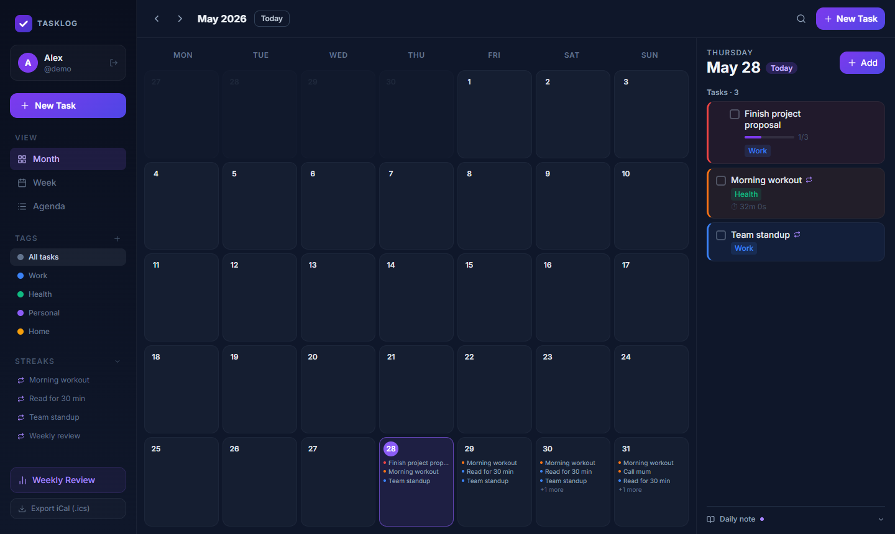
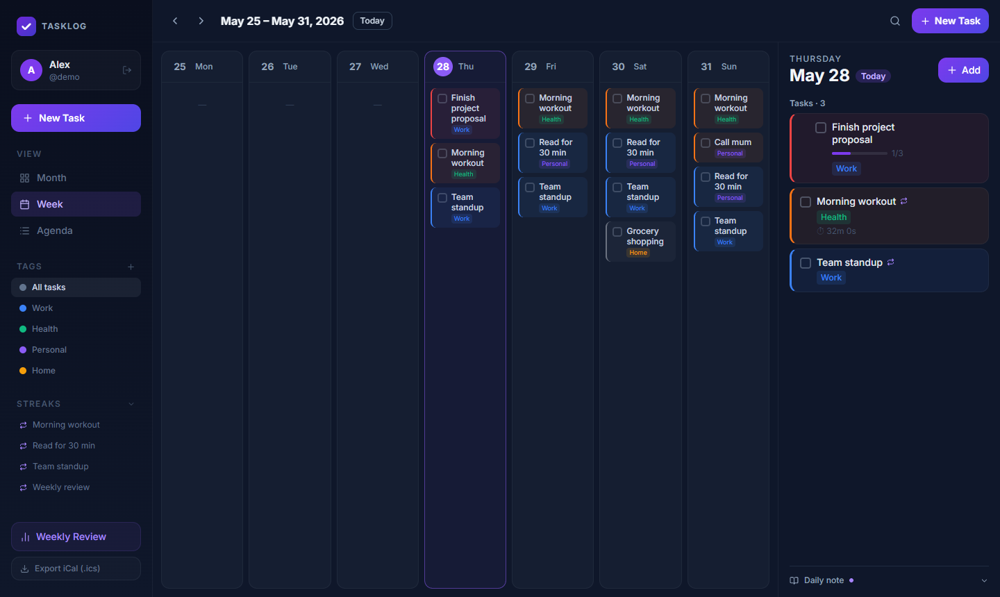
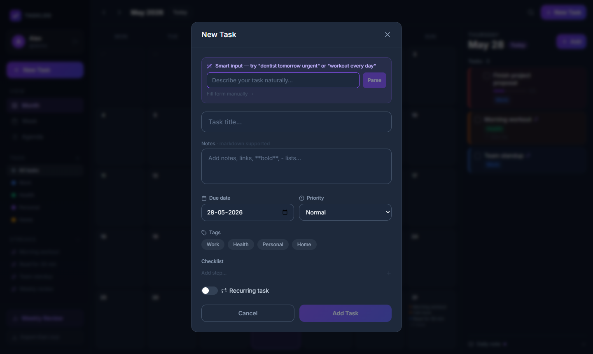
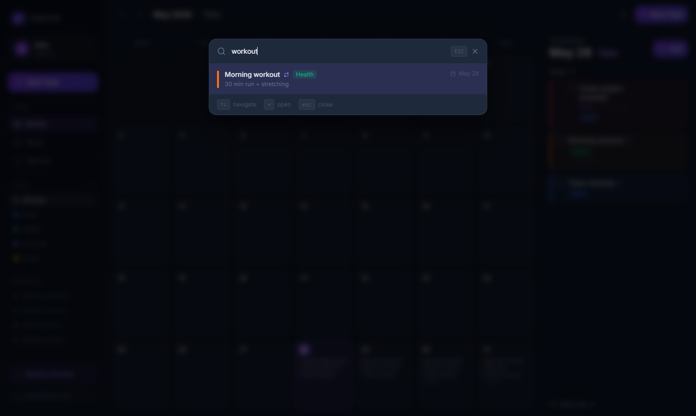
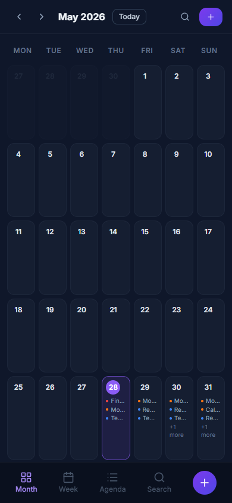
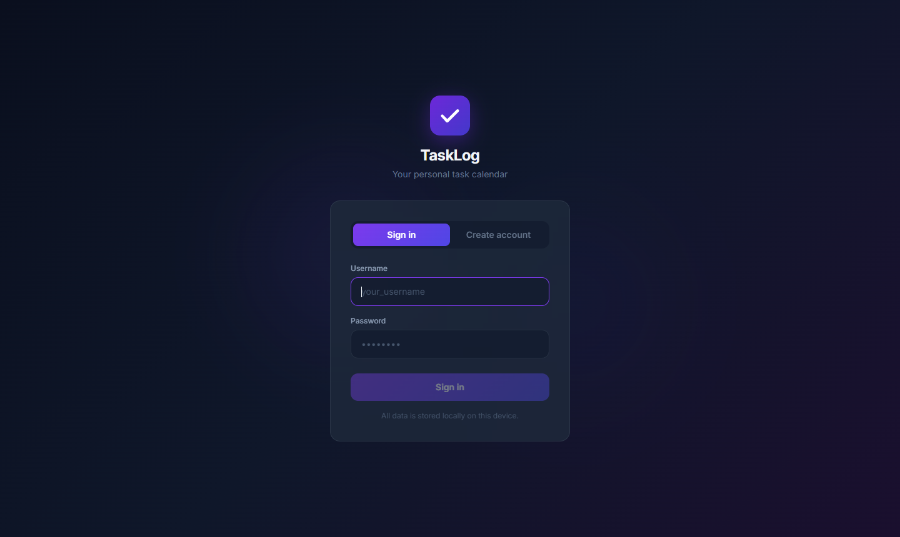

# TaskLog

A beautiful, privacy-first task calendar built for people who actually want to track what they do — not just what they plan to do. Supports multiple local accounts with per-user data isolation — no server, no cloud, no tracking. Everything stays in your browser.

---

## Screenshots

### Dashboard — Month view


### Week view


### New task — Smart natural-language input


### Global search (`Ctrl+K` / `/`)


### Mobile


### Sign in


---

## Features

### Core
- **Month / Week / Agenda views** — switch between layouts with keyboard shortcuts
- **Day panel** — click any date to see and manage tasks for that day
- **Recurring tasks** — daily, weekly (specific days), or monthly with optional end date
- **Overdue rollover** — incomplete past tasks surface on today automatically
- **Drag-to-reschedule** — drag a task card onto a different day in month view

### Organisation
- **Priority levels** — Urgent / High / Normal / Low with colour-coded cards
- **Tags** — create colour-coded tags and filter the entire calendar by tag
- **Sub-tasks / checklists** — break tasks into steps with a visual progress bar
- **Markdown notes** — full Markdown support in task descriptions (bold, lists, links, code blocks)

### Productivity
- **Smart natural-language input** — type *"dentist tomorrow urgent"* or *"workout every Monday"* and the form fills itself
- **Global search** — `Ctrl+K` or `/` to open a fuzzy search palette across all tasks
- **Time tracker** — start/stop a timer on any task; logs are accumulated per task
- **Streak tracking** — recurring tasks show a 🔥 streak counter in the sidebar and on cards
- **Daily journal** — per-day free-text note in the day panel

### Review & Export
- **Weekly Review** — completion rate ring chart, done/missed/upcoming/time-logged stats
- **iCal export** — export all tasks as a `.ics` file (works with Apple Calendar, Google Calendar, Outlook)
- **Browser push notifications** — opt-in reminders for tasks due today (checks every 30 min)

### Access
- **Multi-user** — local sign-up/login with per-user data isolation (SHA-256 hashed passwords)
- **PWA** — installable on desktop and mobile (works offline)
- **Mobile layout** — responsive bottom navigation, full-screen day panel on small screens

### Keyboard shortcuts

| Key | Action |
|---|---|
| `N` | New task |
| `/` or `Ctrl+K` | Open search |
| `T` | Jump to today |
| `←` / `→` | Navigate calendar |
| `Esc` | Close modal |

---

## Tech stack

| Layer | Library |
|---|---|
| Framework | React 18 + TypeScript |
| Build | Vite 6 |
| Styling | Tailwind CSS v4 |
| Drag & drop | @dnd-kit/core |
| Dates | date-fns |
| Icons | lucide-react |
| Markdown | react-markdown + remark-gfm |
| PWA | vite-plugin-pwa + Workbox |
| Storage | localStorage (no backend) |

---

## Getting started

```bash
# Clone
git clone https://github.com/Garuda8887/tasklog.git
cd tasklog

# Install
npm install

# Run dev server
npm run dev

# Build for production
npm run build
```

Open [http://localhost:5173](http://localhost:5173) and create a local account to get started.

---

## Project structure

```
src/
  components/       # UI components (TaskCard, TaskModal, DayPanel, …)
  hooks/            # useAppData — all state + persistence logic
  utils/
    storage.ts      # localStorage load/save with migration
    auth.ts         # local sign-up/login (Web Crypto SHA-256)
    dateUtils.ts    # recurring-task scheduling, streak computation
    nlpParser.ts    # natural-language task input parser
    ical.ts         # RFC 5545 iCal export
    notifications.ts# Web Push Notifications scheduler
  types/            # shared TypeScript interfaces
public/
  icon.svg          # App icon (512×512)
  pwa-*.png         # PWA manifest icons
screenshots/        # README screenshots
```

---

## Data & privacy

Everything is stored in `localStorage` under `taskCalendar_v1_<userId>`. Nothing is sent to any server. Passwords are SHA-256 hashed before storage — suitable for a single-device personal app; not intended as a production auth system.

---

## License

Attribution-Required — see [LICENSE](LICENSE).

You are free to use, modify, and distribute this project provided you give clear credit to the original author: **[Garuda8887](https://github.com/Garuda8887)** with a link back to this repository.
